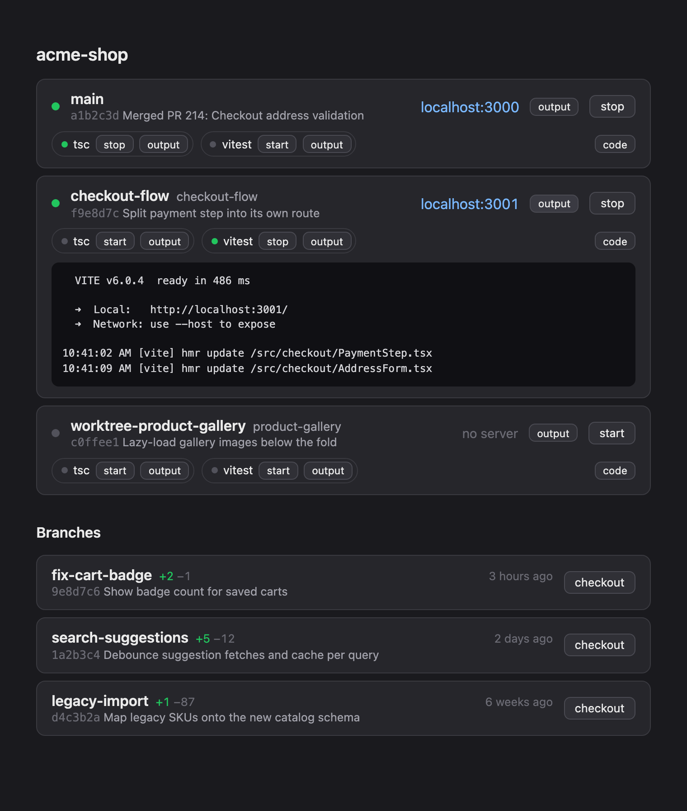

# worktree-dash



Local dashboard for git worktrees on `http://localhost:2999`: every worktree with its branch, last commit, and dev server (port, liveness, start/stop), plus all other local branches with ahead/behind counts against the default branch and a one-click checkout into the main folder.

Each repo can declare extra background processes (watchers like `npx tsc --watch` or `npm run test:watch`) that get per-worktree start/stop chips; `autostart: true` brings a process up together with the worktree's dev server. Every process the dash starts — the dev server included — logs to a file, and an **output** button shows the live tail in an expandable panel.

Dev servers are discovered live via `lsof` — node processes listening on a dev port, matched to worktrees by working directory. No state files. Servers whose worktree has been deleted are killed automatically.

Zero dependencies. Process discovery auto-detects the OS: `lsof` on macOS, `ss` + `/proc` on Linux.

## Install

```sh
git clone https://github.com/TimNuman/worktree-dash.git
cd worktree-dash
npm link
```

## Usage

```sh
worktree-dash            # uses ~/.config/worktree-dash.json, or the git repo you're in
worktree-dash --port 4000
worktree-dash status     # print the dev server + processes for the worktree you're in
```

`worktree-dash status` is made for tooling: hook it into your AI agent's session start so it knows a type-check or test watcher is already running (and where its log lives) instead of launching its own.

## Config

`~/.config/worktree-dash.json`:

```json
{
  "port": 2999,
  "repos": [
    {
      "path": "~/Projects/my-monorepo",
      "appDir": "apps/web",
      "mainPort": 3000,
      "portRange": [3001, 3099],
      "startCommand": "npm run start",
      "processes": [
        { "name": "tsc", "command": "npx tsc --watch --noEmit --preserveWatchOutput", "autostart": false },
        { "name": "tests", "command": "npm run test:watch", "autostart": true }
      ],
      "actions": [
        { "name": "code", "command": "code ." }
      ]
    }
  ]
}
```

`actions` are one-off commands (open an editor, run a script) rendered as a button per worktree; they run detached in the **worktree root** — unlike `processes`, which are tracked watchers running in `appDir`.

- `appDir` — folder (relative to the repo root) where the dev server runs; defaults to the repo root.
- `mainPort` — preferred port for the main checkout; worktrees get the first free port in `portRange`.
- `startCommand` — run with `PORT` set, detached; logs land in `~/.cache/worktree-dash/logs/`.

Starting a worktree server also copies `appDir/.env.example` to `.env` if missing and symlinks the main checkout's `node_modules` into the worktree. Multiple repos each get their own section on the page.

## Claude Code skill

The repo ships a Claude Code skill (`.claude/skills/worktree-dash/`) describing the architecture, the discovery model's invariants, and the `/action` + `status` API contract. Inside this repo it loads automatically; to use it elsewhere:

```sh
# globally, for every Claude session (symlink stays in sync with git pull)
ln -s "$(pwd)/.claude/skills/worktree-dash" ~/.claude/skills/worktree-dash

# or copy into one specific repo
cp -R .claude/skills/worktree-dash /path/to/other-repo/.claude/skills/
```

The global install is the useful one: sessions in repos whose hooks call the dashboard's API get the integration contract without cloning anything into those repos.
